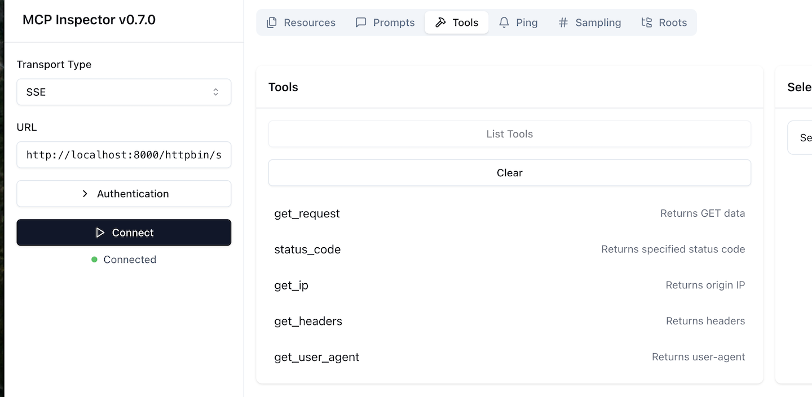

# MCP OpenAPI Server

Run an MCP server which creates tools for a subset of API endpoints based on OpenAPI routes.

Supports:

- JSON and YAML local or remote OpenAPI schemas.
- Exposing a subset of routes based on regular expressions.
- Providing strictly typed arguments to tools based on the schemas (supporting both the JSON body and query parameters).

## Quick Start

Install the necessary dependencies using [uv](https://github.com/astral-sh/uv).

```bash
uv sync
```

Define your servers following the structure of `services.yaml.example`:

```
servers:
  - namespace: stripe
    # Define headers to forward to the server
    headers:
      - Authorization
    # This is the name as it appears to the LLM
    name: Stripe API
    url: https://raw.githubusercontent.com/stripe/openapi/refs/heads/master/openapi/spec3.yaml
    base_url: https://api.stripe.com
    # Select which API paths to expose over MCP
    paths:
      - /v1/customers$

  - namespace: httpbin
    name: httpbin
    url: file://test-specs/httpbin.yaml
    base_url: https://httpbin.org
    paths:
      - /get
      - /status
      - /ip
      - /headers
      - /user-agent
```

- You can point to either a remote URL or local file (using `file://`).
- In `paths` you define Regular Expressions which will match the paths you want to expose.

Then you can run your server to expose it:

```bash
uv run main.py
```

## Inspecting

Alongside the MCP servers, the server exposes a couple HTTP endpoints for inspection.

- `/tools/` and `/tools/{namespace}` will show the tools and parameters they have exposed.

```bash
curl -s localhost:8000/tools | jq '.'
{
  "httpbin": [
    {
      "name": "get_request",
      "description": "Returns GET data",
      "parameters": [
        {
          "name": "freeform",
          "type": "str",
          "default": "None",
          "description": "Any query parameters you want to test with"
        }
      ]
    },
    {
      "name": "status_code",
      "description": "Returns specified status code",
      "parameters": [
        {
          "name": "code",
          "type": "int",
          "default": null,
          "description": "HTTP status code to return"
        }
      ]
    },
    {
      "name": "get_ip",
      "description": "Returns origin IP",
      "parameters": []
    },
    {
      "name": "get_headers",
      "description": "Returns headers",
      "parameters": []
    },
    {
      "name": "get_user_agent",
      "description": "Returns user-agent",
      "parameters": []
    }
  ],
  "stripe": [
    {
      "name": "get_customers",
      "description": "List all customers",
      "parameters": [
        {
          "name": "test_clock",
          "type": "str",
          "default": "None",
          "description": "Provides a list of customers that are associated with the specified test clock. The response will not include customers with test clocks if this parameter is not set."
        },
        {
          "name": "starting_after",
          "type": "str",
          "default": "None",
          "description": "A cursor for use in pagination. `starting_after` is an object ID that defines your place in the list. For instance, if you make a list request and receive 100 objects, ending with `obj_foo`, your subsequent call can include `starting_after=obj_foo` in order to fetch the next page of the list."
        },
        {
          "name": "limit",
          "type": "int",
          "default": "None",
          "description": "A limit on the number of objects to be returned. Limit can range between 1 and 100, and the default is 10."
        },
        {
          "name": "expand",
          "type": "str",
          "default": "None",
          "description": "Specifies which fields in the response should be expanded."
        },
        {
          "name": "ending_before",
          "type": "str",
          "default": "None",
          "description": "A cursor for use in pagination. `ending_before` is an object ID that defines your place in the list. For instance, if you make a list request and receive 100 objects, starting with `obj_bar`, your subsequent call can include `ending_before=obj_bar` in order to fetch the previous page of the list."
        },
        {
          "name": "email",
          "type": "str",
          "default": "None",
          "description": "A case-sensitive filter on the list based on the customer's `email` field. The value must be a string."
        },
        {
          "name": "created",
          "type": "str",
          "default": "None",
          "description": "Only return customers that were created during the given date interval."
        }
      ]
    },
    {
      "name": "post_customers",
      "description": "Create a customer",
      "parameters": []
    }
  ]
}
```

The MCP inspector is also useful for seeing what's available.


